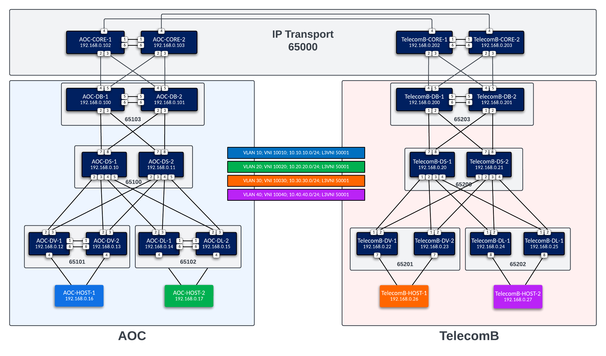

# University of Minnesota AVD Workshop

## ATD Dual Datacenter Topology

The ATD lab is used to create the L3LS EVPN/VXLAN Dual Data Center topology below.

## **Lab Instructions**

The instructions to build and deploy this L3LS Multi-site topology are located in the Lab Guide **[here](https://labguides.testdrive.arista.com/2025.3/automation/ci_avd_l3ls/overview/)**.
